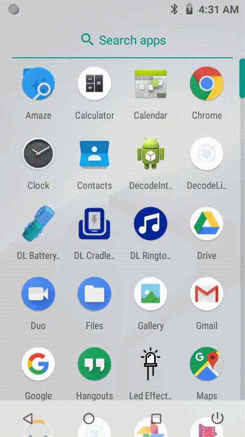

# DecodeListener

Sample Ionic app that uses `barcodeManager.addReadListener` to display barcode data on the screen.

## How it works

The app calls `barcodeManager.addReadListener` to register a callback function to be notified when a read event is triggered.

In [app.component.ts](src/app/app.component.ts), we register the callback, and attach it the `data:received` event.

```js
barcodeManager.addReadListner(
   (data) => {
    this.events.publish('data:received', JSON.parse(data));
   },
   (err)=>{
     alert(err);
   }
);
```

and then in [home.ts](src/pages/home/home.ts), we use the `data:received` event data to update the `barcodeData` and `barcodeType` fields on our app's main page.

```js
events.subscribe('data:received', (data) => {
   this.barcodeData.nativeElement.innerText = data.barcodeData;
   this.barcodeData.nativeElement.style.cssText =
     "color : #45f713; font-size : large; font-weight : bold ";
   this.barcodeType.nativeElement.innerHTML =
     "<b> Barcode Type </b>: " + data.barcodeType;
});
```

## Screenshot

