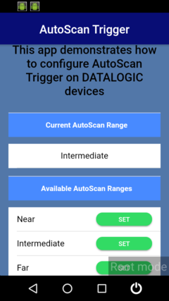
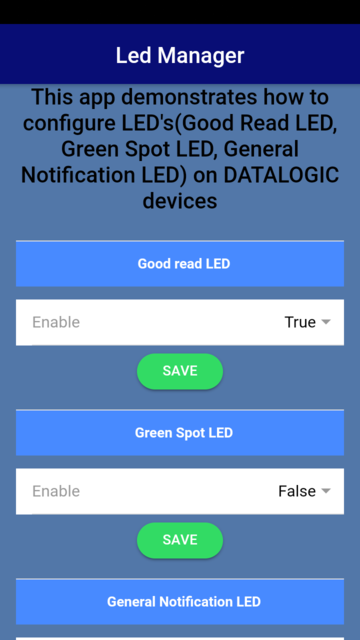
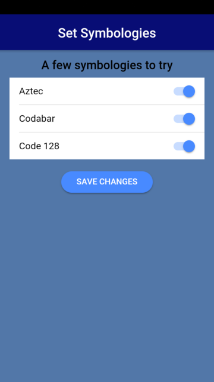
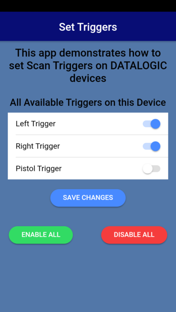

# ionic-samples

Ionic sample apps that use [Datalogic Cordova plugin](https://github.com/datalogic/cordova-plugin-datalogic). Pre-compiled APKs are provided in [releases](https://github.com/datalogic/ionic-samples/releases).

## Sample apps

| Name | Description | Screenshot
|------|-------------|-----------
| [AutoScanTrigger](AutoScanTrigger/) | Uses [`autoScanTrigger`](https://github.com/datalogic/cordova-plugin-datalogic#autoScanTrigger) functions to toggle available triggers. | 
| [DecodeListener](DecodeListener/) | Uses [`barcodeManager`](https://github.com/datalogic/cordova-plugin-datalogic#barcodeManager) functions to display barcode data on the screen. | 
| [LedManager](LedManager/) | Uses [`ledManager`](https://github.com/datalogic/cordova-plugin-datalogic#ledManager) functions to turn device LEDs on and off. | 
| [SetSymbologies](SetSymbologies/) | Uses [`scannerProperties`](https://github.com/datalogic/cordova-plugin-datalogic#scannerProperties) functions to enable or disable barcode symbologies. | 
| [SetTriggers](SetTriggers/) | Uses [`keyboardManager`](https://github.com/datalogic/cordova-plugin-datalogic#keyboardManager) functions to enable or disable device triggers. | 

## Build

First, make sure you are set up to build and run on an Android device. See the [requirements here](https://ionicframework.com/docs/intro/deploying/). You can build and run any of the Ionic app samples with a single command:

```bash
ionic cordova run android --device
```

